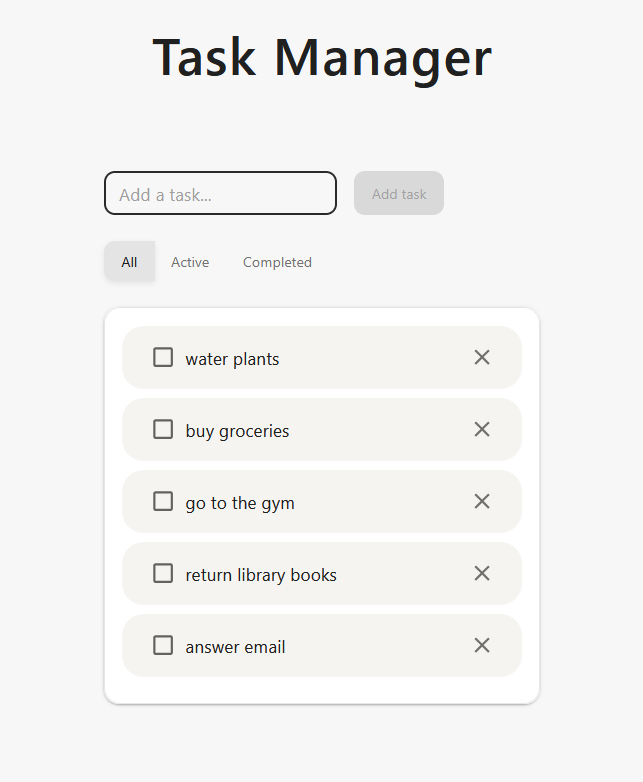
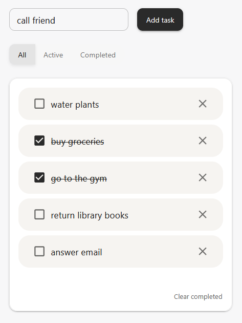
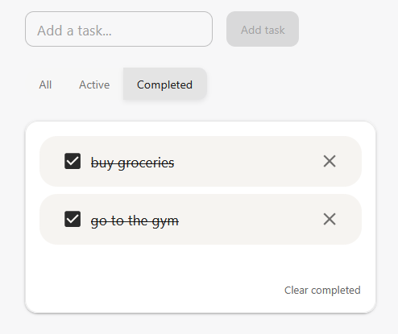

# Task Manager

A minimal task management app built with React and TypeScript. Part of a series of small projects focused on practising core React and TypeScript concepts.


<!--  -->





## Features

- Add and delete tasks
- Mark tasks as completed
- Filter tasks by status - All, Active or Completed
- Clear all completed tasks at once
- Persistent state via localStorage

## Tech Stack

- **React** – component structure, hooks (`useState`, `useEffect`)
- **TypeScript** – typed props, state, and custom types
- **Material UI** – component library and theming
- **Vite** – build tool and dev server

## Getting Started

```bash
npm install
npm run dev
```

## Project Structure

```
src/
├── components/
│   ├── Filter.tsx
│   ├── TaskForm.tsx
│   └── TaskList.tsx
├── types/
│   ├── FilterType.ts
│   └── Task.ts
├── App.tsx
├── theme.ts
└── main.tsx
```

## Concepts Practised

- Lifting state up
- Controlled components
- Derived state and filtering
- Persisting state with localStorage
- Custom types and prop typing in TypeScript
- MUI theming and component overrides

## Planned

- Inline task editing
- Active task counter
- Task categories
